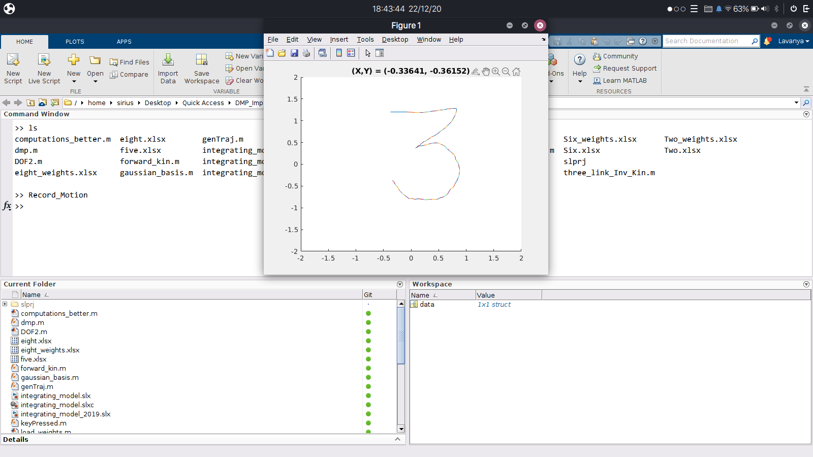
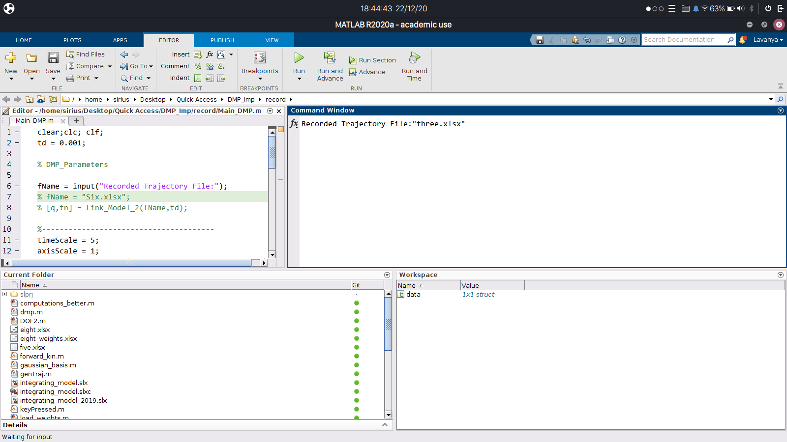
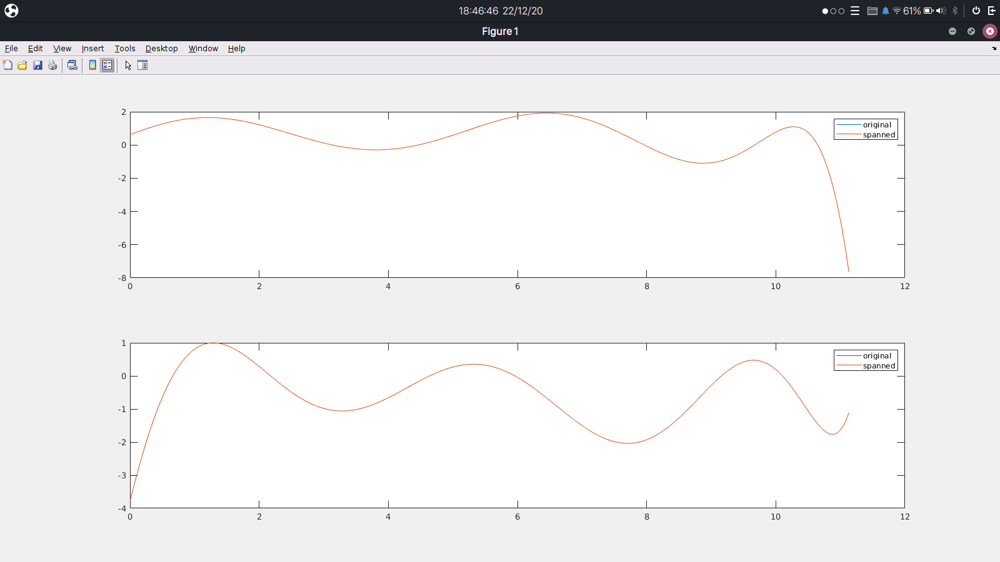
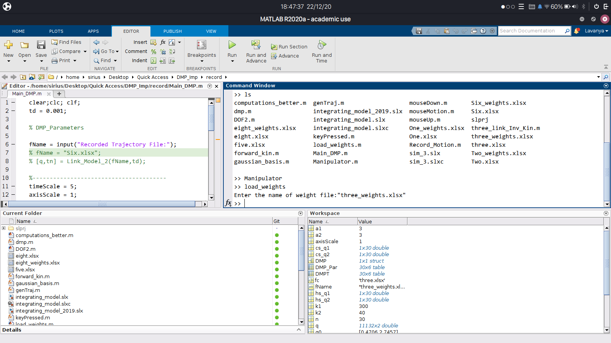
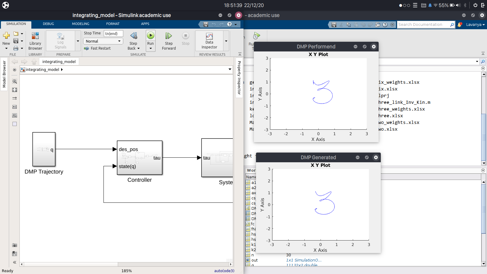
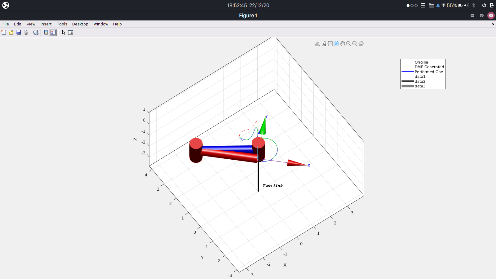

## DMP_Implementation 
This is the course project of ECE670, Monsoon 2020 conducted at IIITD. Aim of the project was to use demonstration learning technique specifically Dynamic Movement Primitives(DMP) in Activities of Daily Livings(ADLs). Project demonstrates the same architecture applied on 2DOF manipulator to retrace End-User's personal handwritting style. Steps below presents the entire execution cycle of the program, from Record of trajectory to Animating the movements of manipulator.

<!-- >> run: Record_Motion    -->
	run: Record_Motion
	(r : to generate waypoits, s: to save  them)
	Record the trajectory and save them

<!-- >> run: Main_DMP -->

	run: Main_DMP
	give the input of file were it was saved earlier step

	Outputs: Force f(x) estimation plots

	Figure 1 graph of force estimation wrt time plus spaneed version
	{estimation for both X and Y}
	estimating f(s) first from DMP equation	then usin that extract weights "wi"

Main_DMP generated weigts and extracted weigts into a new file "name_weigts.xlsx"

	Use the maniulator.m file at last to generate worksace value
	Load the file "load_weights" : Load the DMP Parametes in the workspace

	next step go to simulik;
	DMP Block: Canonical System Generation i.e. x,v,v' Fig1 of the paper

		

	Then we output refrence state i.e. joinstate variables; and design controller and system(repesetig dyamics)

	Use the visualizer(Manipulator.m) file to see the visulation

## Documents:
- [Literature Review](../main/DOCS/Literature_Review.pdf)
- [Project Report](../main/DOCS/Project_Report.pdf)